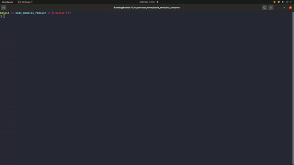
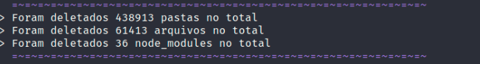

<h1 align="center"> Node_modules-remove </h1>

<h3 align="center">
  Uma ferramenta feita para quem busca remover todos node_modules de suas pasta de projetos de forma automatica
</h3>
<br />
<p align="center">
  
</p>

---

<br />


<p align="center">
  <kbd>
    
  </kbd>
  &nbsp;&nbsp;&nbsp;&nbsp;

  <br/>
  <br/>

  <kbd>
    
  </kbd>
</p>


# Pré-requisitos

Para executar o projeto em sua máquina, você precisará ter o [Node.js](https://nodejs.org/en/) instalado em sua máquina e [Git](https://git-scm.com) para clonar este repositório.
 
<br />

# Como usar

<br />

### Clone o repositório e instale as dependências

```bash
$ git clone https://github.com/kelwinv/Node_modules-remove.git
$ cd Node_modules-remove
```

Instalação de dependecias

```bash
$ npm install
```

<br />

## Depois disso, você podera executar com o comando:
```bash
$ npm run dev
```

<br />

## Você pode usar a pasta de teste para ver como funciona

Basta colar a pasta "pasta_test copy" em public e renomeá-la para "pasta_teste", removendo "copy" do nome da pasta

feito isso, basta aceitar a opção de pasta de teste no terminal, que aparecerá após o início do script

<br />

# Ferramentas ultilizadas 🛠 

- [readline-sync](https://www.npmjs.com/package/readline-sync)
- [Node.js](https://nodejs.org/en/)
- [TypeScript](https://www.typescriptlang.org/)